# Modern Fashion Store

A polished, responsive fashion e-commerce front end built with **React 19**,
**Redux Toolkit**, and **Vite 6**. Demonstrates production-ready patterns for a
clothing store: size/color variants, faceted filtering, wishlist, quick-view
modals, complete checkout flow, user authentication, and dark mode — all
self-contained and deployable as a static site.


> **Portfolio Project** — This is a 2024/25 ground-up rebuild demonstrating
> modern React patterns, Redux Toolkit best practices, and production-ready
> architecture.

---

## ✨ Features

### Shopping Experience

- **Curated catalog** of 26 products across Women, Men, Shoes, and Accessories
- **Size selector** (XS–XL / EU shoe sizes) with add-to-cart validation
- **Color variants** shown as interactive swatches on cards and product pages
- **Product quick-view modal** — pick size/color and add to bag without leaving
  the grid
- **Product detail pages** with image gallery, ratings, delivery info
- **"Complete the look"** styling suggestions + related product recommendations
- **Recently viewed** products section

### Discovery & Filtering

- **Faceted filter sidebar**: brand, price range, size, color, "new", "on sale"
- **Sort** by popularity, newest, price (asc/desc), and rating
- **Debounced live search** across product name, brand, category, and tags —
  results update as you type, with a clear (✕) affordance
- **Category routes** (`/shop/:categoryId`) synced with filter state
- Live result counts, active-filter badges, one-tap clear

### Cart, Wishlist & Checkout

- **Slide-out cart drawer** with quantity controls and free-shipping progress
  bar
- **Size + color aware line items** (same product in two sizes = two lines)
- **Upsell suggestions** in cart ("Complete the look")
- **Wishlist / favorites** with dedicated page
- **Full checkout flow** with form validation and animated order confirmation
- **Cart and wishlist persist** to `localStorage` across reloads

### User Accounts

- **Sign up / sign in** with mock auth service (JWT-shaped tokens)
- **Password hashing** with Web Crypto API (SHA-256 + salt)
- **Saved shipping addresses** for returning customers
- **Order history** that reconciles guest + signed-in orders by email, with
  expandable order detail (line items, cost breakdown, shipping address) and a
  fulfilment status that progresses with order age (processing → shipped →
  delivered)
- Auth isolated behind a single `authService` module — swappable for
  Supabase/Firebase

### Polish & Accessibility

- **Dark / Light mode** with system preference detection and persistence
- **Fully responsive** from mobile (320px) to widescreen (1440px+)
- **Framer Motion** page and component animations with `prefers-reduced-motion`
  support
- **Focus trapping** in modals for keyboard navigation
- **Accessible markup**: semantic landmarks, `aria-*` on interactive controls,
  visible focus rings
- Toast notifications, skeleton loading states, empty states
- **Informational pages**: Shipping & Returns, Size Guide, Contact Us

---

## 📸 Screenshots

<details>
<summary><strong>Home Page (Light & Dark)</strong></summary>

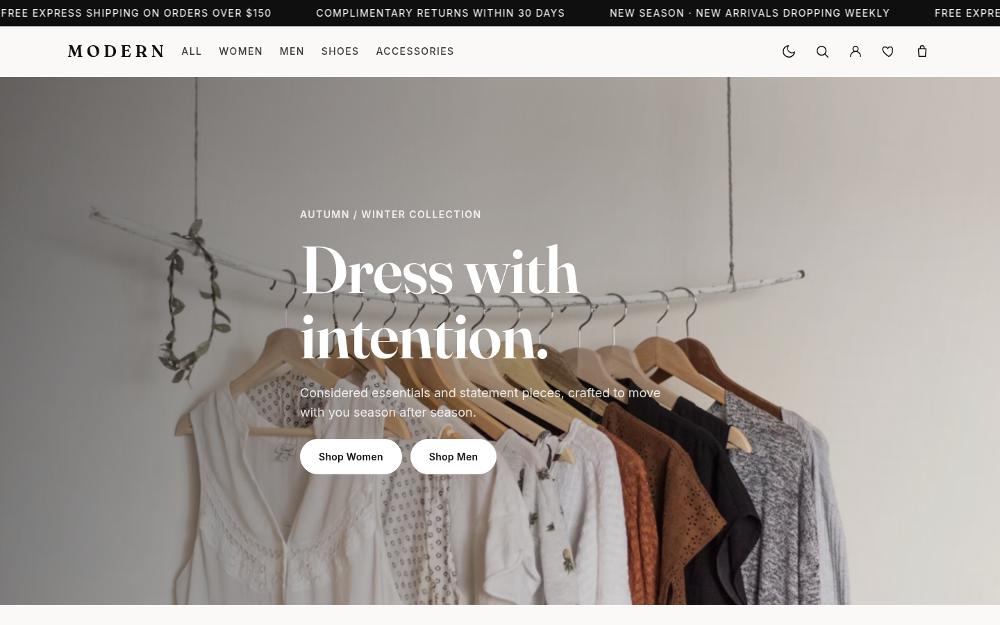
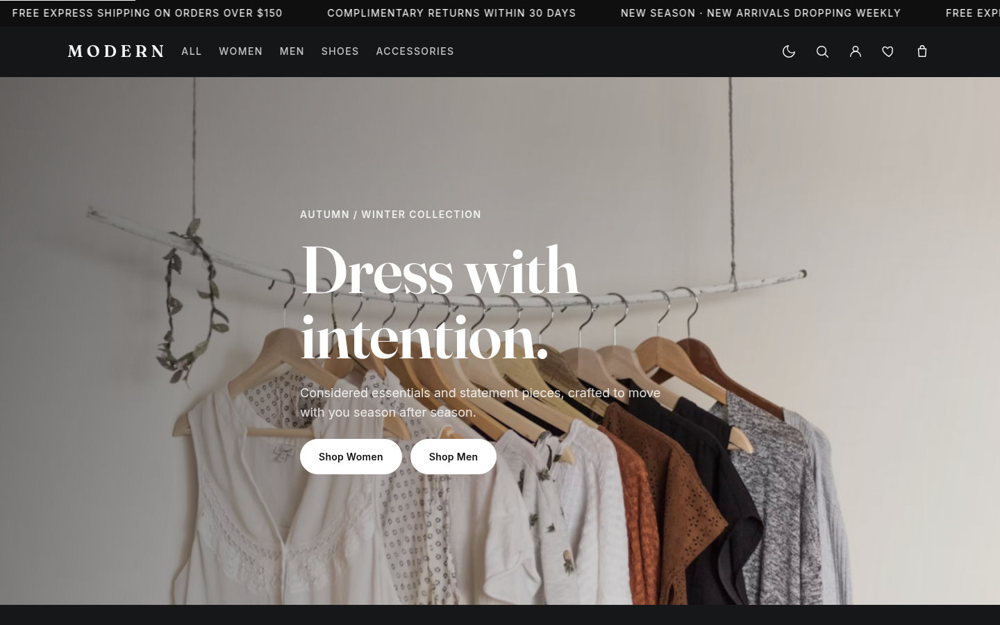

</details>

<details>
<summary><strong>Shop Page (Light & Dark)</strong></summary>

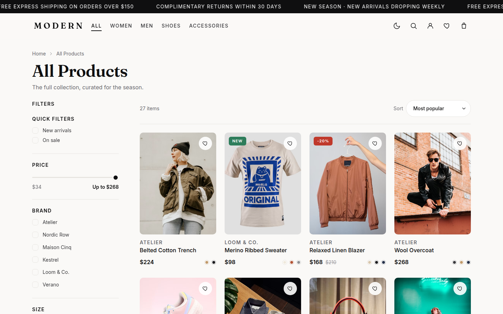
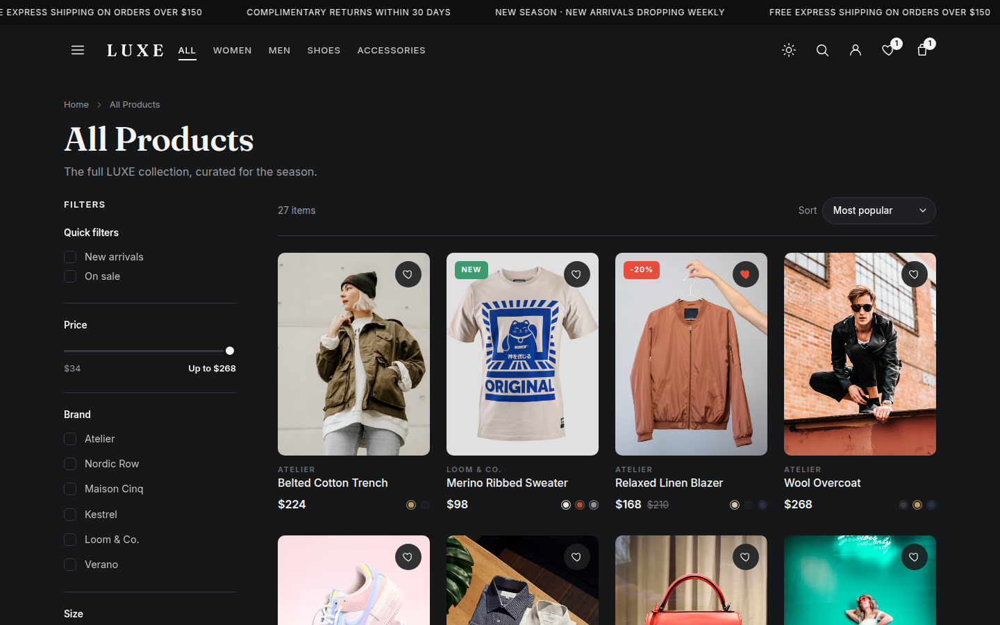

</details>

<details>
<summary><strong>Product Detail (Light & Dark)</strong></summary>

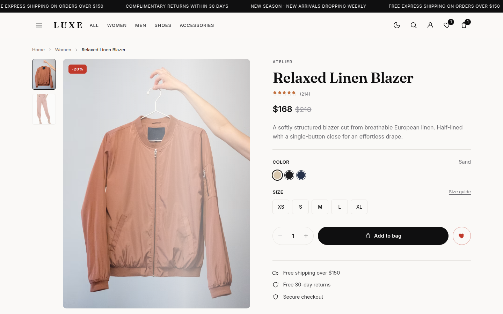
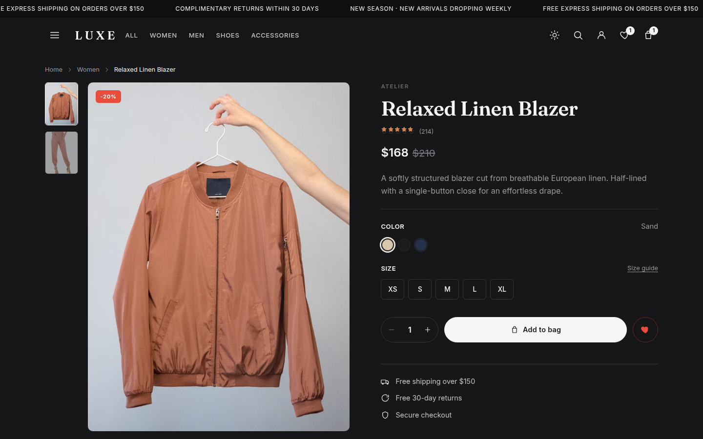

</details>

<details>
<summary><strong>Cart & Checkout</strong></summary>

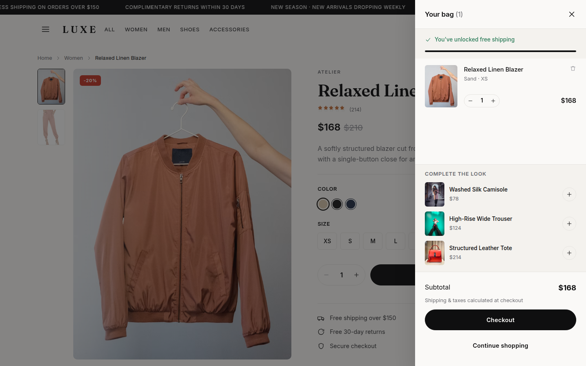
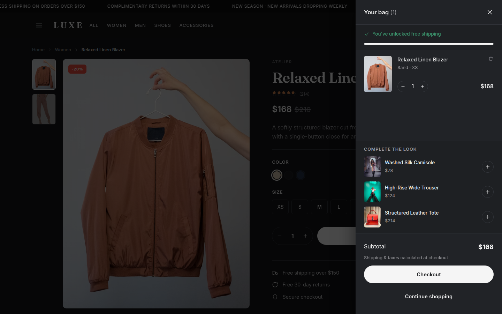
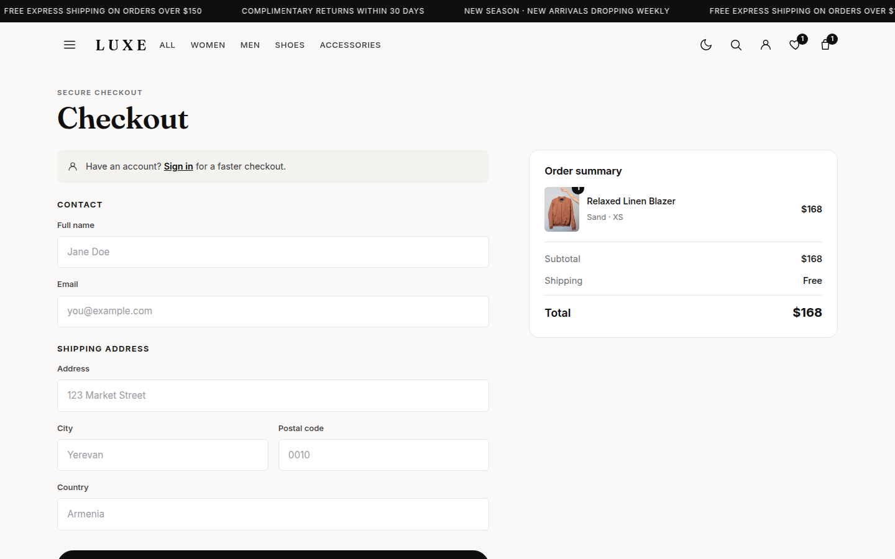
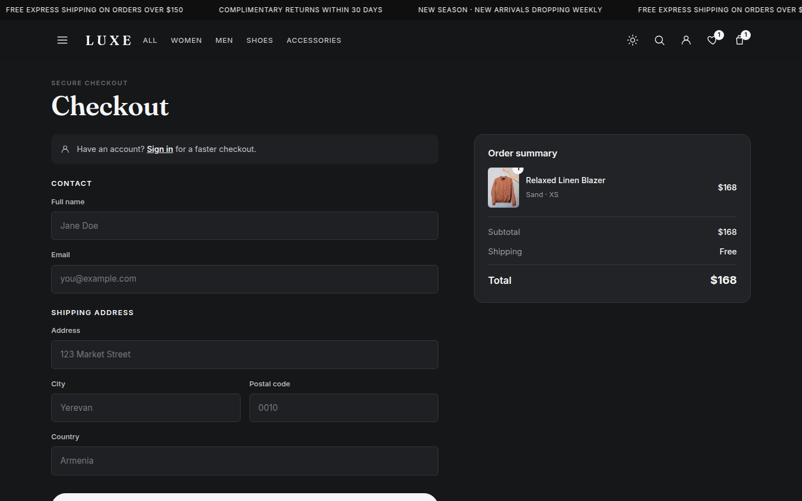

</details>

<details>
<summary><strong>Wishlist (Light & Dark)</strong></summary>

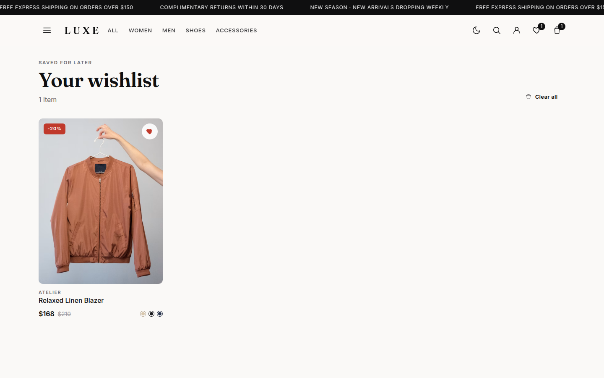
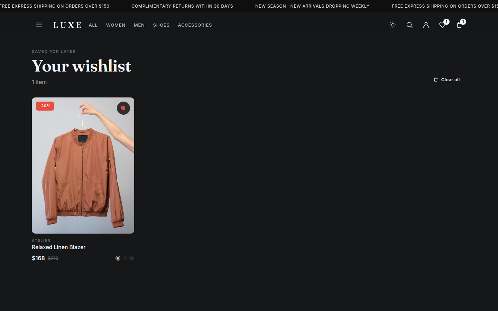

</details>

<details>
<summary><strong>Authentication (Light & Dark)</strong></summary>

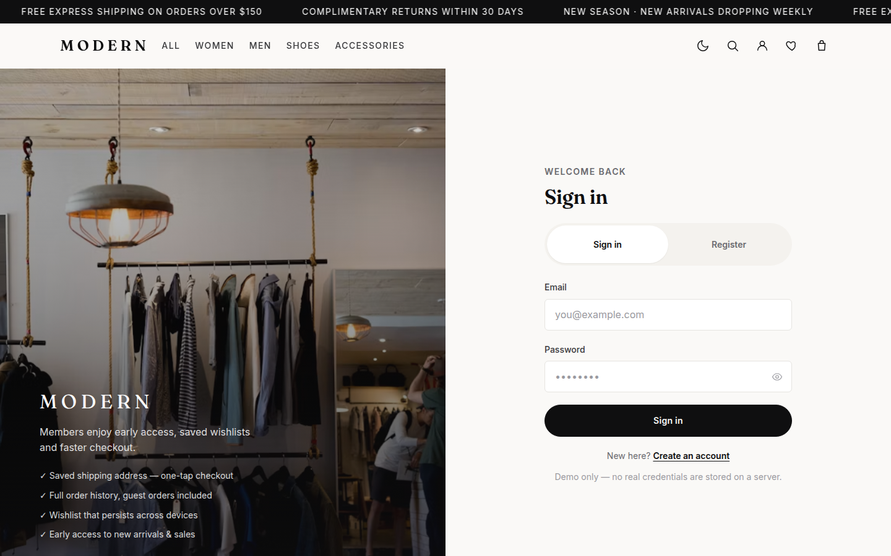
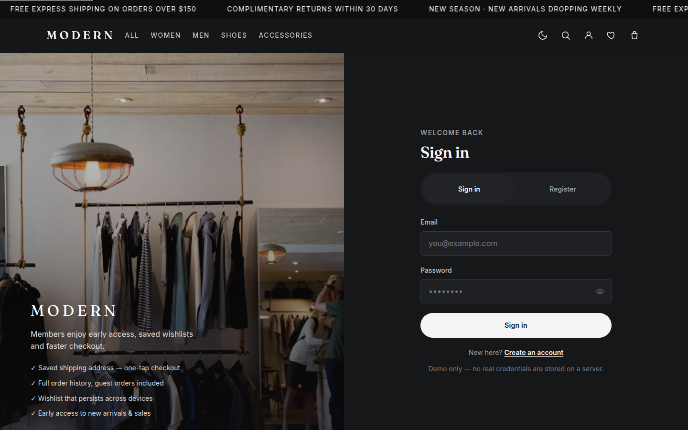

</details>

<details>
<summary><strong>Mobile Responsive</strong></summary>

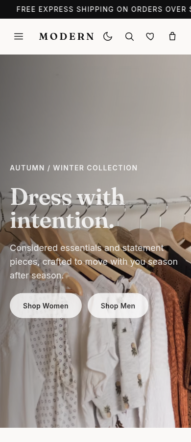
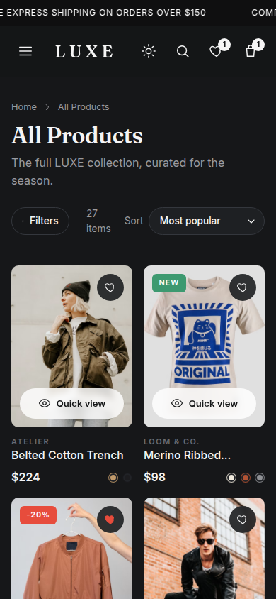
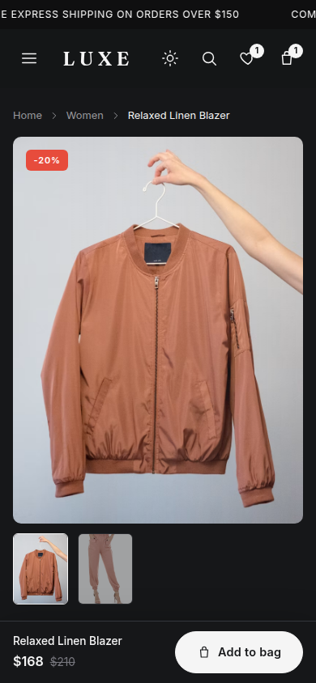

</details>

---

## 🛠 Tech Stack

| Area           | Technology                               |
| -------------- | ---------------------------------------- |
| **Framework**  | React 19                                 |
| **Build Tool** | Vite 6                                   |
| **State**      | Redux Toolkit 2.3 + React-Redux 9        |
| **Routing**    | React Router 7                           |
| **Styling**    | Modern SCSS (design tokens, mixins, BEM) |
| **Animation**  | Framer Motion 11                         |
| **Images**     | Unsplash CDN (responsive params)         |

### Architecture Highlights

- **Route-level code splitting** — each page loads as a separate chunk
- **Memoized selectors** — `createSelector` for derived state
- **Typed Redux hooks** — `useAppDispatch` / `useAppSelector` pattern
- **Service layer abstraction** — mock services easily swappable for real APIs
- **Modular SCSS** — design tokens auto-injected via Vite
- **Manual chunk splitting** — vendor, redux, motion separated for caching
- **Error boundary** — graceful error recovery at app level
- **Accessibility** — skip-to-content link, focus traps, ARIA attributes

---

## 🚀 Getting Started

```bash
# Install dependencies
npm install

# Start dev server (http://localhost:5173)
npm run dev

# Production build
npm run build

# Preview production build locally
npm run preview

# Lint
npm run lint
```

**Requirements:** Node 18+ (developed on Node 22)

---

## 📁 Project Structure

```
src/
├── components/
│   ├── cart/           # CartDrawer, CartLine
│   ├── common/         # Icon, Price, StarRating, ColorSwatches, ToastStack, ErrorBoundary
│   ├── layout/         # Navbar, Footer, AnnouncementBar, Layout
│   ├── product/        # ProductCard, QuickViewModal, SizeSelector, SizeGuideModal
│   └── shop/           # FilterSidebar
├── data/               # products.js (catalog + helpers)
├── hooks/              # useDebounce, useFocusTrap, useModalDismiss, usePageTitle
├── pages/              # Home, Shop, ProductDetail, Wishlist, Checkout, Auth, NotFound, StaticPages
├── services/           # authService, orderService, recentlyViewedService
├── store/              # Redux slices (cart, wishlist, filters, auth, ui)
├── styles/             # SCSS architecture (abstracts, base)
└── utils/              # formatPrice, productHelpers (formatSize)
```

### State Management

| Slice      | Responsibility                                                    |
| ---------- | ----------------------------------------------------------------- |
| `cart`     | Line items keyed by `id::size::color`, subtotal & count selectors |
| `wishlist` | Set of favorited product IDs with memoized `selectIsWished`       |
| `filters`  | Category, search, brand, size, color, price, sort + filtered list |
| `auth`     | User session via async thunks, token validation                   |
| `ui`       | Cart drawer, mobile filters, quick-view, toasts, theme            |

Cart and wishlist are persisted to `localStorage` via a store subscriber with
shallow equality checks.

---

## 🎨 Design System

Styling uses SCSS organized with a
[7-1-ish](https://sass-guidelines.org/architecture/) structure:

- **`abstracts/`** — Design tokens (colors, typography, spacing, radius,
  shadows, breakpoints) and mixins (`bp()`, `bp-down()`, `clamp-lines()`).
  Auto-injected via Vite.
- **`base/`** — CSS reset and utility classes (`.btn`, `.badge`, `.field`,
  skeleton shimmer)
- **Component styles** — Co-located `.scss` files using BEM naming

### Theme Support

CSS custom properties enable dark/light mode:

- System preference detection on first load
- User preference persisted to localStorage
- Smooth color transitions on toggle

---

## 🔒 Security Considerations

This is a **demo/portfolio project** with mock authentication. Production
implementations should:

- Use a real auth provider (Supabase Auth, Firebase Auth, Auth0)
- Store sessions server-side or use secure HTTP-only cookies
- Implement proper password hashing server-side (bcrypt/argon2)
- Add CSRF protection and rate limiting
- Validate all inputs server-side

The mock auth demonstrates the patterns (salted hashes, token structure) without
the server infrastructure.

---

## 📊 Bundle Analysis

Production build (gzipped):

- **Main bundle:** ~17KB
- **Redux:** ~5KB
- **Framer Motion:** ~36KB
- **Vendor (React + Router):** ~92KB
- **Pages:** 1-3KB each (lazy loaded)

Total initial load: ~150KB gzipped (excellent for a full-featured SPA)

---

## 🚢 Deployment

### Recommended: Vercel (or Netlify)

This is a **static site** with no backend requirements. Vercel/Netlify are
ideal:

```bash
# Deploy to Vercel
npm i -g vercel
vercel

# Or connect your GitHub repo for automatic deployments
```

**Why Vercel over Firebase Hosting?**

- Zero-config for Vite/React projects
- Better DX with instant preview deployments
- Excellent performance (edge network)
- Free tier is generous

Firebase Hosting works fine too, but requires more configuration and is better
suited when you're also using Firebase services (Firestore, Auth, Functions).

### Build Output

The `dist/` folder contains the production build:

- Static HTML/CSS/JS files
- Pre-compressed assets
- Ready for any static host

---

## 🗺 Roadmap

- [ ] Swap mock auth for **Supabase Auth** (JWT + row-level security)
- [ ] Persist orders and wishlist server-side
- [ ] Product reviews and ratings
- [ ] Inventory management
- [ ] Unit/integration tests (Vitest + Testing Library)
- [ ] E2E tests (Playwright)
- [ ] PWA support (offline, installable)

---

## 📝 License

MIT — free to use as a portfolio reference or learning resource.

---

## 👤 Author

Built by [Avet Badalyan](https://github.com/AvetBadalyan) as a portfolio project
demonstrating modern React/Redux patterns and production-ready frontend
architecture.

**Live Demo:**
[modern-fashion-store.vercel.app](https://modern-fashion-store.vercel.app)
_(deploy to see it live)_

**Repository:**
[github.com/AvetBadalyan/modern-fashion-store](https://github.com/AvetBadalyan/modern-fashion-store)
